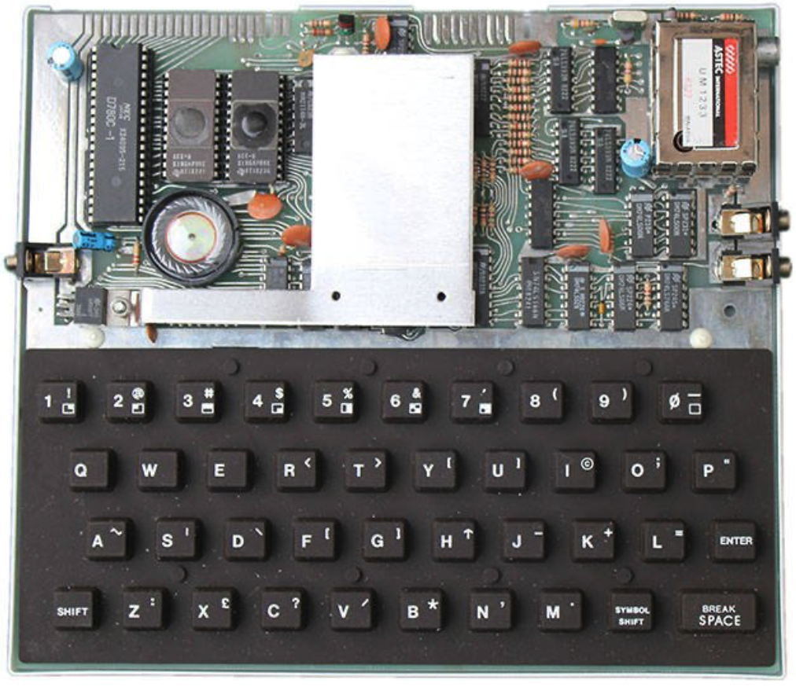
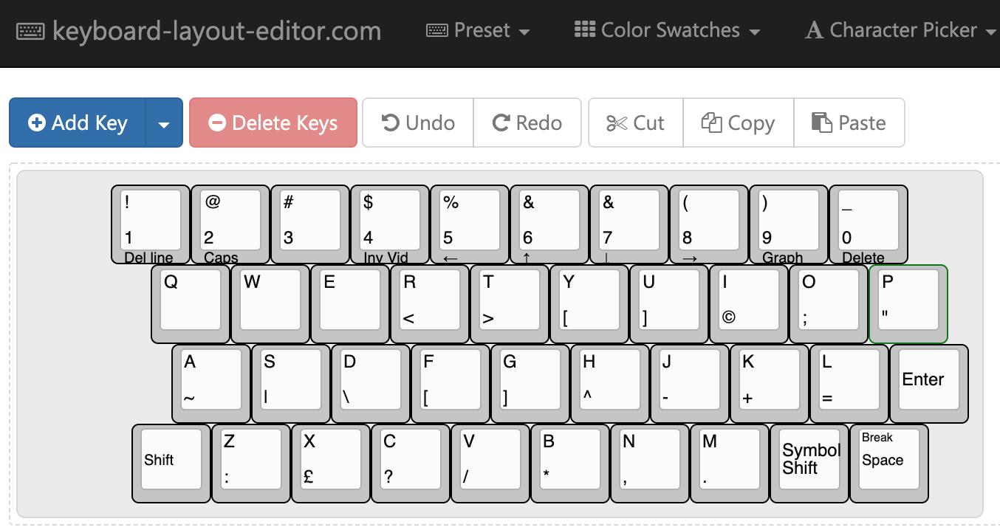
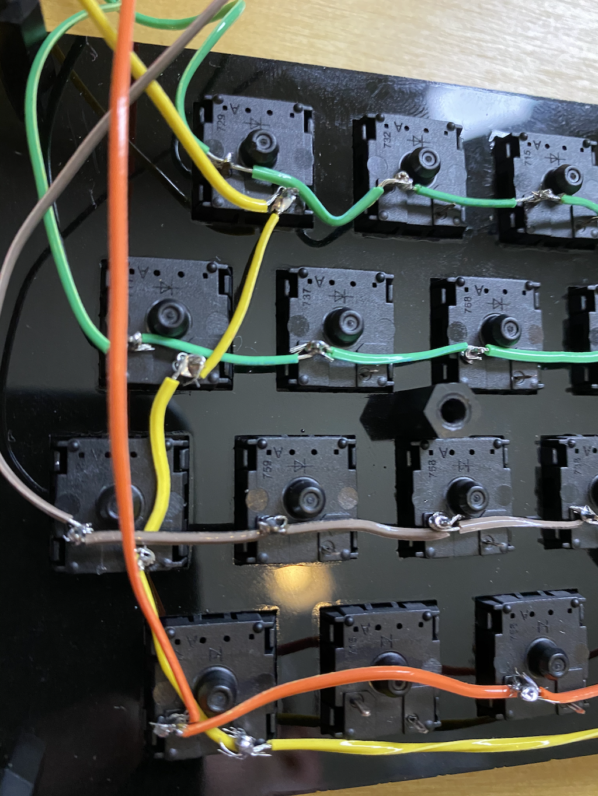
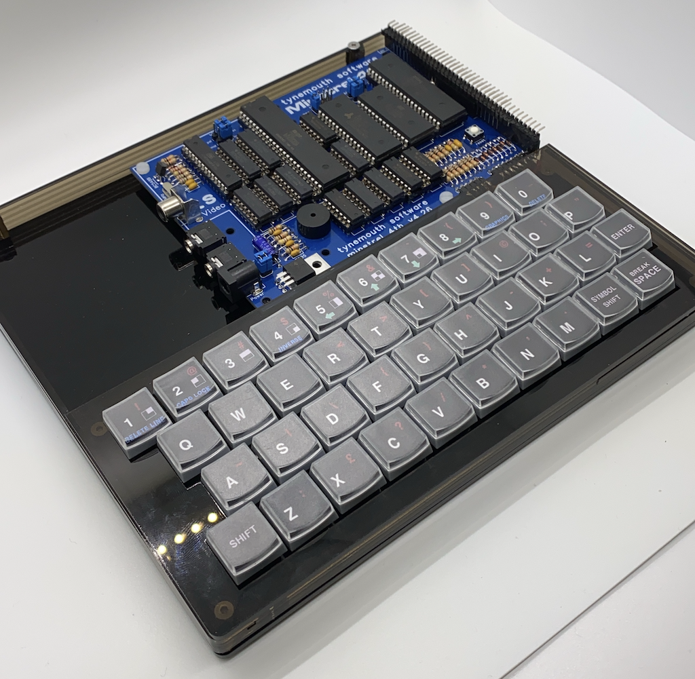
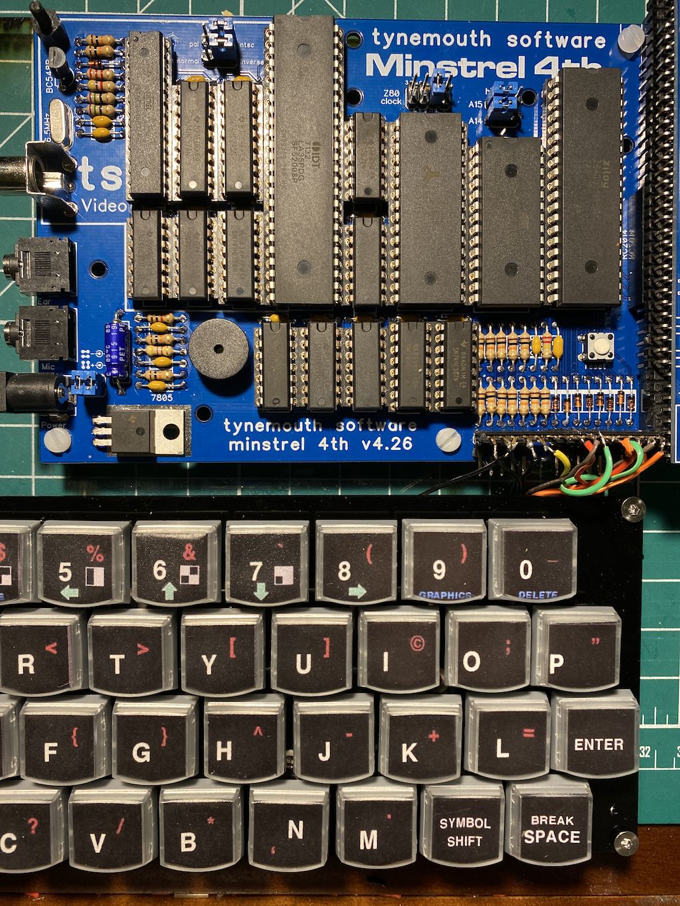
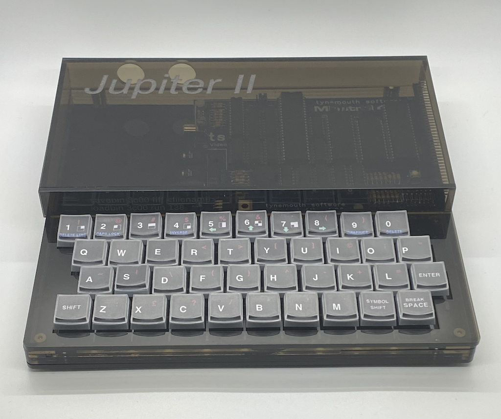

# Keyboard

The original Jupiter Ace had a terrible keyboard: rubbery, but even cheaper and less reliable than the ZX Spectrum (if you can believe it).

The Minstrel4th kit has an optional keyboard made with tactile buttons. It works perfectly well, but it's not fun to type long programs on it. I needed something better.

## Plates

The secret to making a keyboard I found, is getting the right keyboard template designed and made. Can you imaging the effort in creating a suitable layout for a keyboard? Thankfully you don't have to - you can [use this website](http://www.keyboard-layout-editor.com/#/) or [here](http://www.keyboard-layout-editor.com/##@@_x:1&a:0%3B&=!%0A1%0A%0A%0ADel%20line&=%2F@%0A2%0A%0A%0ACaps&_a:4%3B&=%23%0A3&_a:0%3B&=$%0A4%0A%0A%0AInv%20Vid&=%25%0A5%0A%0A%0A%E2%86%90&=%2F&%0A6%0A%0A%0A%E2%86%91&=%2F&%0A7%0A%0A%0A%E2%86%93&=(%0A8%0A%0A%0A%E2%86%92&=)%0A9%0A%0A%0AGraph&=%2F_%0A0%0A%0A%0ADelete%3B&@_x:1.5&a:4%3B&=Q&=W&=E&=R%0A%3C&=T%0A%3E&=Y%0A%5B&=U%0A%5D&=I%0A%C2%A9&=O%0A%2F%3B&=P%0A%22%3B&@_x:1.75%3B&=A%0A~&=S%0A%7C&=D%0A%5C&=F%0A%5B&=G%0A%5D&=H%0A%5E&=J%0A-&=K%0A+&=L%0A%2F=&_a:6%3B&=Enter%3B&@_x:1.25&fa@:2%3B%3B&=Shift&_a:4&f:3%3B&=Z%0A%2F:&_f:3%3B&=X%0A%C2%A3&_f:3%3B&=C%0A%3F&_f:3%3B&=V%0A%2F%2F&_f:3%3B&=B%0A*&_f:3%3B&=N%0A,&_f:3%3B&=M%0A.&_a:6%3B&=Symbol%20Shift&_a:4&fa@:1&:0&:0&:0&:0&:0&:2%3B%3B&=Break%0A%0A%0A%0A%0A%0ASpace) on Chrome which might include my design. It will create a layout you can then export, like this:

[{x:1,a:0},"!\n1\n\n\nDel line","@\n2\n\n\nCaps",{a:4},"#\n3",{a:0},"$\n4\n\n\nInv Vid","%\n5\n\n\n←","&\n6\n\n\n↑","&\n7\n\n\n↓","(\n8\n\n\n→",")\n9\n\n\nGraph","_\n0\n\n\nDelete"],
[{x:1.5,a:4},"Q","W","E","R\n<","T\n>","Y\n[","U\n]","I\n©","O\n;","P\n\""],
[{x:1.75},"A\n~","S\n|","D\n\\","F\n[","G\n]","H\n^","J\n-","K\n+","L\n=",{a:6},"Enter"],
[{x:1.25,fa:[2]},"Shift",{a:4,f:3},"Z\n:",{f:3},"X\n£",{f:3},"C\n?",{f:3},"V\n/",{f:3},"B\n*",{f:3},"N\n,",{f:3},"M\n.",{a:6,f:3},"Symbol Shift",{a:4,fa:[1,0,0,0,0,0,2]},"Break\n\n\n\n\n\nSpace"]

You can then copy this text [into this website](http://builder.swillkb.com), and the clever system will generate some outlines for you (the ones I made are in this repo).

Ater than, find someone with a laser cutter or other tools and make a thin rigid plate to hold the switches. Thin acrylic just about works, but it won't be very strong.

## Switches

You will need 40 switches. I ordered some Cherry switches from Amazon, but there are cheaper places. Make sure the switches you pick match the ones you select in the template creation tool.

You'll also need key caps. Sadly there are no professionally made Jupiter Ace keycaps. I used some clear lid clip-on keycaps (which are.. you know.. 1980s) with a set of labels I printed on a nice color printer. The design I made is in the repo. Now all you have to do is solder up the keys.

## Wiring the way I did it vs. Wiring the sensible way

The keys are arranged in a matrix of columns and rows, although there are a few weird bits. The best guide is the manual that comes with the Minstrel4th computer which does a great job of listing which switches need soldered together. There's nothing fancy: no arduino-based keyboard controller, these are just switches connected via some diodes and pull-ups directly to the Z80.

The sensible way to solder a keyboard matrix is to get a PCB made. This will not only replace all the wiring but provide a rigid and strong base. You should definitely do that. 

The next most sensible way to solder the keys is to get a long piece of single strand wire, and lay it over the keys and solder each point, repeating for each row. Then cover these wires in something insulating like Kapton tape, and lay the column wires over and solder them.

On no account just cut up a hundred short pieces of hook-up wire and solder each switch. It's madness. Don't do it. Learn from my mistake.

## Assembling

Use various spacers to combine the keyboard baseplate and the plate that goes on top. It can look pretty sharp (as long as no-one looks at the wiring side).

## Connecting the keyboard

Again, nothing subtle. The column and row wires connect directly to the computer. There's a little connector on the Minstrel4th.

## Issues

The Jupiter Ace keyboard electronics are not sophisticated. The matrix of switches is scanned multiple times a second, and if the switch is closed, the row/column values will provide the software with a unique value. And that's the key being pressed. There is no roll-over or buffering or anything clever, so if you make a keyboard that is too nice, you'll quickly discover the Ace can't keep up. There is no way round this without a complete rewrite of the Ace ROM and no-one wants to do that. One improvement can be achieved by overclocking the Ace, something with the Minstrel4th can do. With the clock at double speed, typing is a little better.

But be warned: you might spend a lot of time and effort improving the keyboard but the overall experience is much the same. For long typing projects, you are probably better off using an emulator (not that they can handle the keyboard considerably better, but at least they're free).

# Case

The original Jupiter Ace case was also terrible. Thin, brittle plastic. And yet somehow I made something worse.

It started off ok, with a solid acrylic plastic base to attach the keyboard and the Minstrel board. Then I got cocky and tried to make the rest. Let's just say acrylic is great for 2D cuts, and anything else takes more time and talent than I have.

